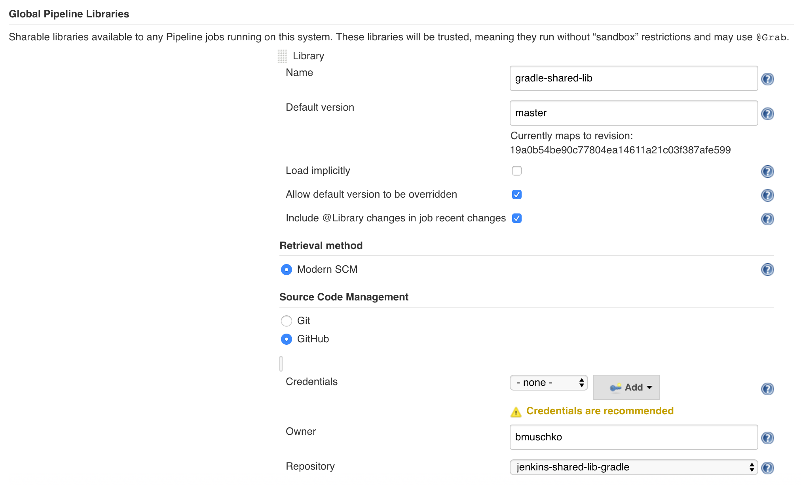

= Jenkins shared library for invoking Gradle builds

Defining Jenkins pipelines with code is great! But what if you identify repeatitive code across various projects? That's a job for a https://jenkins.io/doc/book/pipeline/shared-libraries/[shared library].

This shared library provides methods for invoking Gradle builds with the help of the Wrapper. The functionality handles differences between Linux and Windows environments. The shared library provides two different ways to invoke a Gradle command.

== Adding the shared library to Jenkins

Add the shared library under Manage __Jenkins » Configure System » Global Pipeline Libraries__. The following screenshot configures the library with the name `gradle-shared-lib` and pulls the latest commit from the `master` branch. Please refer to the https://jenkins.io/doc/book/pipeline/shared-libraries/#using-libraries[documentation] for more information.

== Using the functionality in a pipeline

There are two ways to use the functionality in a pipeline definition as described below.

=== Using a global variable

You can define a https://jenkins.io/doc/book/pipeline/shared-libraries/#defining-custom-steps[custom step] with the help of a global variable defined in the shared library. The following usage example demonstrates the use of such a call.

_Declarative Pipeline_
[source,groovy]
----
@Library('gradle-shared-lib') _

pipeline {
    agent any
    stages {
        stage('Gradle version with global var') {
            steps {
                gradlew '-v'
            }
        }
    }
}
----

_Scripted Pipeline_
[source,groovy]
----
@Library('gradle-shared-lib') _

node {
    stage('Gradle version with global var') {
        gradlew '-v'
    }
}
----

=== Using a class implementation

The same behavior can be achieved with the help of a https://jenkins.io/doc/book/pipeline/shared-libraries/#accessing-steps[class implementation]. As you can see in the example below, you have to import the relevant class first and then call a method on it. The class implementation is more future proof as it allows for enhancing the functionality going forward.

_Declarative Pipeline_
[source,groovy]
----
@Library('gradle-shared-lib') import com.bmuschko.jenkins.Gradle

def gradle = new Gradle(this)

pipeline {
    agent any
    stages {
        stage('Gradle version with class') {
            steps {
                script {
                    gradle.wrapper '-v'
                }
            }
        }
    }
}
----

_Scripted Pipeline_
[source,groovy]
----
@Library('gradle-shared-lib') import com.bmuschko.jenkins.Gradle

def gradle = new Gradle(this)

node {
    stage('Gradle version with class') {
        gradle.wrapper '-v'
    }
}
----